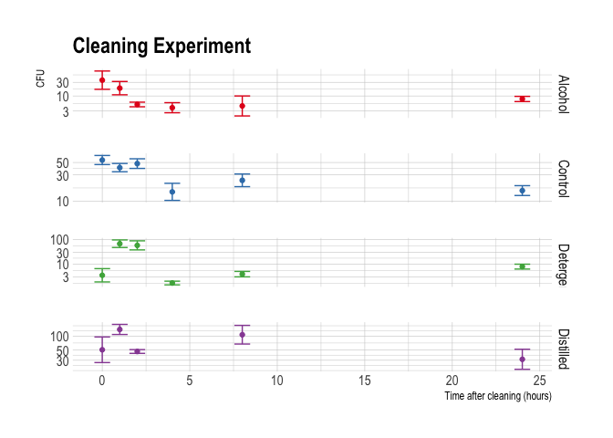

Cleaning
================

This document is a brief summary of the surface cleaning experiment
performed by Beth in the public health labs at the University of Leeds.

# Experimental set up

5 coupons of PVC (3 x 3cm) were inoculated with with 1ml of *S. aureus*
solution at

cfu/ml and allowed to dry for 60 min in a stable condition (inside a
fume cupboard - would need to measure typical humidity or look to see if
those data exist).

The coupons were then cleaned with one of the following:

-   Disinfectant wipe (Tuffie - 70% solution of Isopropyl Alcohol BP),
-   detergent wipe (Tuffie - Contains amongst other ingredients less
    than 5% cationic surfactants, amphoteric surfactants and EDTA
    (Vernacare, 2018). They contain a mixture of non-ionic constituents
    at neutral pH),
-   distilled water wipe (Tuffie - alcohol wipes, after being dried,
    washed and re-soaked in distilled water.)
-   no cleaning - control

The surfaces were then sampled using a cotton swab at the following
time-points:
.

**NB** The control samples were diluted by $10^$3 before plating out due
to high concentrations anticipated.

<!-- -->

------------------------------------------------------------------------

## Governing equations

We consider a number of models which potentially represent the phyisical
action of cleaning method on hands. Below we propose three such models,
with increasing complexity

-   Option 1. Re-growth on hands but no recontamination from contacts

")

where

is the regrowth rate per unit time
,

is the maximum efficacy of cleaning method and

is the decay rate induced by the cleaning method with units
.

-   Option 2. Re-growth on hands and recontamination from surface
    contacts over time

")
